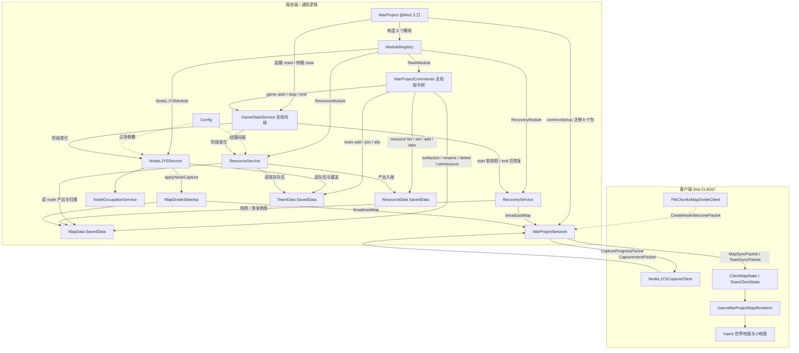
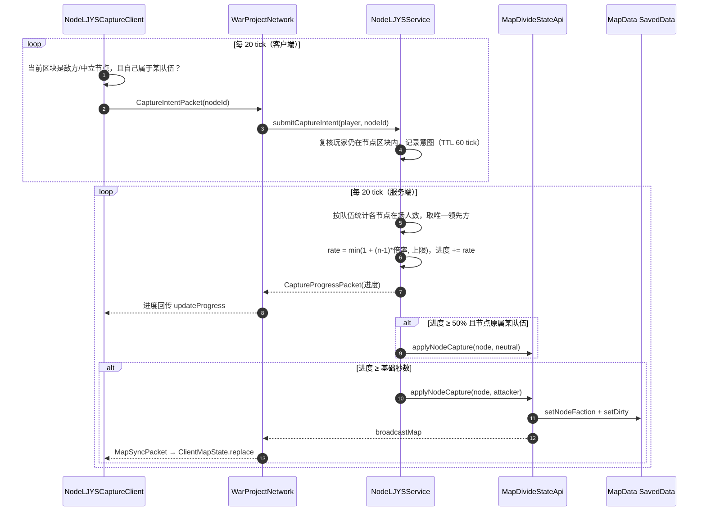

# War Project — 项目结构与运行流程说明

> 分析对象：本仓库（Minecraft Forge 1.20.1 模组 `war_project` v1.0.0）
> 分析方式：通读全部 32 个 Java 源文件 + 3 个资源文件 + Gradle 构建脚本，并用 grep 交叉核验真实依赖边。
> 配套可视化：`docs/architecture.html`（可交互架构图）、`docs/architecture.json`（生成规格）。

---

## 1. 项目一句话

把世界按**区块**切成「节点 Node」与「战区 Warzone」，玩家所属**队伍 Team**在敌方节点区块内驻留够时间就能把节点打下来（改阵营）；地图上的归属配色由客户端渲染层叠到 Xaero / FTB Chunks 地图上。

四个业务子系统：**地图划分（map）**、**队伍（team）**、**兵棋占领（nodeLJYS）**、**资源经济（resource，弹药 ammo / 燃料 fuel 两种产出）**；另有一个**全局游戏生命周期内核（module/GameStateService）**，它不属于任何模块，负责 `/warproject game start|stop|end` 的阶段状态并向订阅者广播。模块之间互不直接耦合：资源与占领各自订阅阶段变化，其余全部通过 `WarProjectNetwork` 与三个 `SavedData` 交换数据。

**VP 战局（2026-09-20）**：`nodeLJYS/VpWarService` 把 `vp=true` 的 node 变成决定胜负的目标——每个**同盟簇**（队伍 + 其传递盟友）持有一份战分（`vpWarScoreStart`，默认 500），RUNNING 期间每秒结算：某 vp node 归 A 簇时，A 以外的每个簇按 `vpWarDrainPerMinutePerNode`（默认 30/分）扣分（多座累加）；任一簇降到 0 立刻走 `GameStateService.transition(ENDED)` 并全服播报胜方。战分不落盘（与阶段一致）。客户端在灵动岛**上方**渲染战局条：左侧蓝条（本方簇）、右侧红条（当前分数最高的敌对簇）、中间一排五角星（每 vp node 一颗，颜色随归属，被占领中显示顺时针进度弧）。第五个模块 `recovery` 同样只订阅阶段变化：`game start` 生效前把**方块世界**（各维度的 region 文件）整份备份，`game end` 的重置跑完后只回滚这局被改动过的区块——加载中的区块逐块写回并同步客户端，未加载的区块直接把备份字节写回存档。

---

## 2. 目录层级

```
War_Project/
├─ build.gradle                # ForgeGradle 6 构建脚本（含可选兼容源码集开关）
├─ settings.gradle             # 插件仓库（MinecraftForge Maven）
├─ gradle.properties           # MC 1.20.1 / Forge 47.4.10 / modid / 版本
├─ gradlew(.bat)  gradle/      # Gradle 8.8 wrapper
├─ src/main/resources/
│  ├─ META-INF/mods.toml       # 模组元数据 + Mixin 配置声明 + 可选依赖
│  ├─ mixins.war_project.json  # Mixin 配置（required=false，3 个 Xaero 客户端 Mixin）
│  └─ pack.mcmeta
├─ src/main/java/com/flowingsun/war_project/
│  ├─ WarProject.java          # ★ 入口：@Mod，构造模块、注册事件与配置
│  ├─ Config.java              # ForgeConfigSpec：占领秒数 / 速率 / 调试开关
│  ├─ module/                  # 模块契约与注册表（WarProjectModule, ModuleRegistry）
│  │                           # + 全局游戏生命周期内核（GamePhase, GameStateService，不属于模块）
│  ├─ map/                     # 节点 / 战区：MapData(SavedData), MapDivideModule, MapDivideStateApi
│  ├─ team/                    # 队伍：TeamData(SavedData), TeamApi, TeamModule, TeamChatService, TeamClientState
│  ├─ nodeLJYS/                 # 占领 + VP 战局：NodeLJYSModule, NodeLJYSService, NodeOccupationService, CaptureProgressQueryApi, VpWarService, VpWarState
│  ├─ resource/                # 个人资源：ResourceKind, ResourceData(SavedData), ResourceService, ResourceApi, ResourceModule
│  ├─ recovery/                # 方块世界备份与回滚：RecoveryModule, RecoveryService, RecoveryApi, WorldBackup, RegionFileStore, ChunkRewriter
│  ├─ html/                    # 全局 HTML 渲染内核（非模块）：Css, HtmlNode, HtmlDocument, HtmlLayout, HtmlRenderer, HtmlTextures, HtmlVector, HtmlViewHost
│  ├─ client/Resource*.java    # 顶部 HUD ResourceIslandView（战局条 + 资源岛，同一文档 html/top_hud.html）+ 转移面板 ResourceTransferController + ResourceClientState + ResourceHudOverlay
│  ├─ client/VpWarClientState.java      # VP 战局客户端镜像（顶部 HUD 的数据来源）
│  ├─ client/HtmlResources.java        # 从 assets/war_project/html/*.html 读模板（失败回退内置常量）
│  ├─ client/SuperbWarfareCompat.java  # SBW 可选兼容（纯类名判定，无编译期依赖）
│  ├─ net/                     # WarProjectNetwork：SimpleChannel + 8 个数据包
│  ├─ command/                 # WarProjectCommands：/warproject 全局指令树（含 game / resource）
│  ├─ client/                  # ClientMapState, NodeLJYSCaptureClient, client/xaero/XaeroWarProjectMapRenderer
│  └─ mixin/                   # WarProjectMixinPlugin：按类是否存在决定是否应用 Xaero Mixin
├─ src/optionalXaero/java/     # 可选兼容层（9 个文件）：Xaero 世界地图 / 小地图高亮与叠加
├─ src/optionalFtb/java/       # 可选兼容层（1 个文件）：FTB Chunks 大地图编辑器
├─ scripts/                    # 与 mod 无关的本地辅助脚本（DSH 渲染器 vendor / KaTeX / Mermaid 校验）
└─ build/                      # ForgeGradle 中间产物
```

**可选源码集机制**：`build.gradle` 在 `libs/` 与 `D:/mc/.minecraft/versions` 里按文件名片段查找 Xaero / FTB / Architectury 的 jar；找到才把 `src/optionalXaero/java`、`src/optionalFtb/java` 加入 `sourceSets.main`。找不到时这些类根本不参与编译，`WarProjectMixinPlugin` 返回 `false` 使对应 Mixin 不应用，模组本体照常运行。

---

## 3. 主流程图



### 补充：占领闭环时序



---

## 4. 模块逐项说明

### 入口与骨架

| 模块 | 文件 | 职责 |
| --- | --- | --- |
| 模组入口 | `WarProject.java` | `@Mod("war_project")` 入口。构造 `MapDivideModule / TeamModule / NodeLJYSModule`，交给 `ModuleRegistry`；注册 `FMLCommonSetupEvent`、`ServerStarting/Stopping`、`RegisterCommands`、`PlayerLoggedIn` 到 Forge 事件总线；注册 Common 配置。内部静态类 `ClientModEvents` 在 `Dist.CLIENT` 下注册 `NodeLJYSCaptureClient`。 |
| 模块注册表 | `module/ModuleRegistry` + `WarProjectModule` | 定义统一生命周期接口（`onCommonSetup / onClientSetup / onServerStarting / onServerStopping / onRegisterCommands`），并把事件按顺序转发给各模块（顺序即模块注册顺序）。是「加新子系统」的唯一扩展点。 |
| 配置 | `Config.java` | `ForgeConfigSpec` 定义 7 项：节点占领基础秒数、停止后每秒回退、每多一名领先玩家的加速倍率与其上限、占领调试日志开关、资源结算间隔秒数（`resourceSettleIntervalSeconds`，默认 5）、资源结算调试日志开关。 |
| 全局游戏内核 | `module/GamePhase` + `module/GameStateService` | 三态生命周期 `STOPPED / RUNNING / ENDED`。**不属于任何模块**：由入口在起服时 `reset()`（阶段不落盘，开服固定 STOPPED）、停服时 `clearActive()`；`transition(server, target)` 先按注册顺序回调 `onBeforeGamePhaseChanged`（此时旧阶段仍是当前阶段，recovery 在这里备份世界），再改阶段并按同一顺序回调 `onGamePhaseChanged`；单个订阅者异常只记日志、不影响其它订阅者。 |

### 三大业务子系统

| 模块 | 文件 | 职责 |
| --- | --- | --- |
| 地图划分 | `map/MapData` | `SavedData`（`war_project_map`，挂在主世界 DataStorage）。存 `Node`（id / 名称 / 阵营 / 颜色 / 更新时间 / 区块集合 / **`vp` 标记**）与 `Warzone`（额外绑定 `nodeId`）。负责增删改、重命名、阵营写入、NBT 读写、区块重叠校验、客户端快照。另存**地图区域** `Bounds`（区块坐标矩形，NBT 段 `bounds`，未设置时缺段），它是「可活动区域」的唯一权威，随 `clientSnapshot` 一起下发。 |
| | `map/MapDivideModule` | 服务端启动时把 `MapData` 标脏触发落盘，并把 `MapBoundaryService` 注册到事件总线（停服反注册）；客户端启动时若检测到 FTB Library + FTB Chunks 就**反射**注册 `FtbChunksMapDivideClient`（用反射是为了 jar 缺失时不触发 NoClassDefFoundError）。 |
| | `map/MapDivideStateApi` | 地图状态**门面**：区块→节点/战区查询、快照读取、创建节点+战区、改阵营、重命名、读写地图区域矩形；任何写操作成功后统一 `broadcastMap`。重命名还会同步改 `NodeOccupationService` 的进度键。 |
| | `map/MapBoundaryService` | **越界执法**（挂 Forge 总线，每 tick）。判定只针对主世界坐标（其他维度不受限）且创造/旁观豁免，用 `Bounds.containsBlock`（半开区间）。首个越界 tick 记录并下发 `OutOfMapWarningPacket(graceTicks)`；持续越界不再发包（客户端本地倒数）；超出 `Config.outOfMapReturnSeconds`（默认 30s）即 `player.kill()`（等价 `/kill`）并清状态。回到区内、切维度、豁免或区域被清空时发 `OutOfMapWarningPacket(-1)` 清除提示；玩家下线由 `retainAll(在线 UUID)` 兜底回收。**不与游戏阶段耦合**（始终生效）。 |
| 队伍 | `team/TeamData` | `SavedData`（`war_project_teams`）。存 `Team`：显示名、颜色、友伤、名牌/死亡消息可见性、碰撞规则、前缀后缀、成员、管理员、盟友。提供加入/退出/清空/设管理员/改属性/结盟/查玩家所属队伍。 |
| | `team/TeamApi` | 队伍门面：查玩家队伍、校验阵营 id 合法性、判断是否同盟、广播队伍快照。 |
| | `team/TeamModule` | 服务端启动注册 `TeamChatService`；`onRegisterCommands` 调 `WarProjectCommands.register`。 |
| | `team/TeamChatService` | `ServerChatEvent`（HIGHEST 优先级）拦截：处于队伍频道的玩家，其聊天被取消并按队伍转发；`/warproject team msg switch` 切换公共/队伍频道。装有 e33chat 且其群组引擎可用时，频道切换交给 e33chat 的群组页签，本服务不再拦截。 |
| | `team/TeamE33ChatBridge` | 可选 e33chat 集成（纯反射，无编译期依赖）：把每个队伍与每个「同盟簇」声明成 e33chat 群组，队伍随即出现在 e33chat 的群组页签里。 |
| 兵棋占领 | `nodeLJYS/NodeLJYSService` | 核心玩法循环。挂 Forge 事件总线，`ServerTickEvent` 每 20 tick 执行：清理过期意图（TTL 60 tick）→ 按节点统计各队伍在场人数 → `uniqueLeader`（并列则无人领先）→ 与当前阵营同盟则不进反退（`recover`）→ 否则按人数倍率推进度、广播进度、≥50% 且原属某队时先中立化、≥阈值时把节点判给攻方并清进度。 |
| | `nodeLJYS/NodeOccupationService` | 占领进度内存表（`nodeId → Progress(attackerFactionId, progressSeconds)`），支持重命名搬迁。不落盘，重启即清空。 |
| | `nodeLJYS/CaptureProgressQueryApi` | 只读查询门面，供 `/warproject progress node` 使用。 |
| | `nodeLJYS/NodeLJYSService` / `VpWarService` | `VpWarService` 是 VP 战局服务端内核：`computeClusters` 用 `TeamData` 的盟友关系算**同盟簇**（键 = 排序后的队伍 id 用 `|` 连接），RUNNING 时每 20 tick 结算一次——每个 `vp()` 节点按其归属簇给**其它每个簇**扣 `vpWarDrainPerMinutePerNode/60` 分（多座累加），分数 1 位小数、节点占领百分比 2 位小数量化后与上次快照比较，**只有真的变化才广播**；任一簇 ≤0 时 `finish()` 播报胜方并切 `ENDED`（`ending` 标志防重入）。RUNNING 初始化全部分数为 `vpWarScoreStart`、ENDED 清空、STOPPED 冻结。簇成员变化（合并/拆分）时该簇按新键重新从初始分开始。 |
| | `nodeLJYS/VpWarState` | 战局快照 record（`running, maxScore, sides[], nodes[]`）：`Side(key, teamIds, name, score)`、`NodeState(nodeId, name, ownerFaction, ownerSideKey, attackerSideKey, capturePercent)`。网络包与 `/warproject vpwar status` 共用。 |
| | `nodeLJYS/NodeLJYSModule` | 服务端启动把 `NodeLJYSService` 与 `VpWarService` 注册到事件总线并订阅游戏阶段，停止时反注册、移除监听并 `clearActive()`。 |
| 资源经济 | `resource/ResourceKind` | 两种资源的唯一枚举：`AMMO("ammo")` / `FUEL("fuel")`，`parse(String)` 供指令与包解析；非法值不猜测、直接失败。 |
| | `resource/ResourceData` | `SavedData`（`war_project_resources`）。**每玩家**一对存量（`players[] = {id(scoreboardName), ammo, fuel}`；旧档 `teams[]` 段读档时忽略并记日志），提供 `stock` / `setAmount` / `addAmount` / `addStocksForPlayers` / `spend` / `clearAll` / `playerNames`。**落盘**，重启后存量保留。两种资源有**硬上限 999**（`ResourceData.MAX_AMOUNT`）：结算入账、管理员 set/add、转移、NBT 读档全部经同一个 clamp。 |
| Chromium 渲染后端（可选，自建） | `client/cef/`（CefNatives, CefBootstrap, CefOsrView, CefPaintRegions, WpCefBrowser, CefTexture, CefKeyMap, CefWebRenderer）+ `client/web/`（WebRenderer, WebRendererService, WebSnapshots, WebPages, WebJson, CefAvailability）+ `src/cefApi/java/org/cef/**` | **自建 CEF 集成，不依赖任何第三方 mod**（详见 `docs/CHROMIUM_BACKEND.md`）。`CefNatives` 按 `java-cef-builds/<commit>/windows_amd64.tar.gz` 下载（约 119 MiB，支持 `<gameDir>/war_project-cef/` 预置离线安装）→ 校验 → 自写 tar.gz 解压；`CefBootstrap` 设置 `jcef.path` 与 `windowless_rendering_enabled` 后启动 `CefApp`/`CefClient`（**命令行开关必须交给 `CefApp.getInstance(args, settings)`**：Windows 分支的 `startup()` 忽略参数，只给 `startup` 传开关会让 `--disable-gpu` 等全部静默失效——2026-09-22 实测确认并修复；默认 `cefUseGpu=false` 走 Skia+SwiftShader，`true` 放开 ANGLE D3D11，两者对比见 `docs/CHROMIUM_BACKEND.md` 3.6），消息泵由 tick 与绘制共用同一节流器调用 `N_DoMessageLoopWork()`（不用 mixin；可见 ≤ `cefMaxFrameRate` 次/秒、隐藏 2 次/秒，泵频率即表面帧率上限），命令行只保留软件合成与"关掉浏览器后台服务/多余 renderer/V8 堆上限"两类开关；`CefWebRenderer` 默认**按需启动**：没进入世界时根本不拉起 Chromium 进程，界面由自研内核绘制。`CefOsrView` 继承 `CefBrowserOsr`，**按脏矩形**（`CefPaintRegions` 负责裁剪/合并/退化）用 `MemoryUtil.memCopy` 拷贝、以 `glTexSubImage2D(GL_BGRA, GL_UNSIGNED_INT_8_8_8_8_REV)` 上传子矩形（每个区域先按行打包进紧凑临时缓冲，`GL_UNPACK_ROW_LENGTH` 恒为 0；越界区域退化为整帧）（首帧/尺寸变化/纹理未初始化时整帧；待上传区域累积，丢帧不会留下过期像素），经 `CefTexture extends AbstractTexture` 包装后用 `GuiGraphics.blit`（混合 `ONE, ONE_MINUS_SRC_ALPHA` + `flush()`）绘制；页面是 `assets/war_project/web/overlay.html`（表面 136×110，**自 2026-09-21 起只承载转移面板**：`drawSurface` 要求 `panelOpen`、`renderIsland` 空实现、表面下移到 `y = TOP_MARGIN(0) + TOPHUD_HEIGHT(30) + 1` 紧贴内核顶部 HUD 的岛底边），以 `data:` URL 内联加载，JS↔Java 走 `CefMessageRouter` 的 `cefQuery`。**任何失败（无网/校验失败/\`UnsatisfiedLinkError\`/异常）都回退自研内核**：`WebRendererService.active()` 返回 null，而 `html/` 内核与现有页面原样保留。配置：`webRenderer`、`cefMirror`、`cefLazyStart`、`cefMaxFrameRate`、`webDiagnostics`；脏区逻辑可离线自检：`bash scripts/verify-cef-paint-regions.sh`。 |
| HTML 渲染内核 | `html/`（Css, HtmlNode, HtmlDocument, HtmlLayout, HtmlRenderer, HtmlViewHost） | 全局客户端内核，**不属于任何模块**，零依赖。支持 `div/span/b/img/button/input/hr` 与 SVG 子集 `svg/path/circle/ellipse/rect/polygon/polyline`、内联 `style` 与 `<style>` 内的 `.class`/`#id`/元素/`:hover`/`:active` 规则、**抗锯齿圆角**（`HtmlTextures` 用圆角矩形解析 SDF 逐像素求覆盖率，1px AA；逐行 `fill` 仅作回退）、`box-shadow` 列表（含 `inset`，按距离场模糊成真实软阴影）、`border` 简写 + 描边高光环（顶部更亮，形成立体感）、`background-image:linear-gradient(上,下)` 光泽、flex(row/column)、margin/padding/gap、align-items、justify-content、opacity、transform(scale/translate)、transition 缓动；生成的形状以**白色 + alpha** 纹理上传（`NativeImage.setPixelRGBA` 通道序不影响结果），绘制时用 `setColor` 着色，避免自建顶点与 GUI 批次冲突；矢量图形由 `HtmlVector` 以 4×4 超采样覆盖率光栅化成纹理（非零环绕填充，支持 `d` 的 M/L/H/V/C/S/Q/T/Z 与 `fill`/`fill-opacity`），因此任意尺寸下都是真曲线、无需图片素材；**CSS 规则不烘焙**，切换 class 后由 `HtmlDocument.refreshStyles()` 重新求值（`HtmlViewHost` 按 `classRevision` 检测），否则运行时 `setClass` 不生效；`img` 必须用 11 参数 `blit`；`<input>` 复用 vanilla `EditBox`（外层外观由内核绘制）。模板从 `assets/war_project/html/*.html` 读取，失败回退内置常量。 |
| | `resource/ResourceService` | 挂 Forge 总线，`ServerTickEvent` 累计 tick：阶段非 RUNNING 时清零待结算 tick（不补算），攒满 `intervalTicks = max(1, round(resourceSettleIntervalSeconds * 20))` 后按真实经过秒数分别结算 `ammoPerMinute * elapsedSeconds / 60` 与 `fuelPerMinute * elapsedSeconds / 60`，只发给 node 归属且在 `TeamData` 中仍存在的队伍（盟友不分成）。 |
| | `resource/ResourceApi` | 服务端门面：`stock` / `stocks`（只列现存队伍）/ `set` / `add`（管理员，任意阶段，写入同样受 999 上限夹紧）/ `spend(kind)`（消耗，仅 RUNNING）。 |
| | `resource/ResourceModule` | 注册服务与阶段监听；收到 `ENDED` 时清空所有队伍资源（两种一起），并在任何阶段变化后广播一次资源快照（HUD 显隐与刷新）。 |
| 顶部 HUD（战局条 + 资源岛）+ 转移面板 | `client/ResourceIslandView`、`client/ResourceTransferController` | **2026-09-21 融合版**：同一个内核 HTML 文档 `assets/war_project/html/top_hud.html` 同时渲染战局条与资源岛，二者共用一条显隐规则 = `running && hasTeam && 非 SBW 炮镜`（无屏幕时由 `ResourceHudOverlay` 调，聊天等 Screen 打开时由 `ScreenEvent.Render.Post` 调）。布局：顶部横向长条贴 `y=0`、宽度 = 屏宽×0.54（clamp 200–360，量化 4px、由 Java 每帧钉住）、高 14px、圆角 7px、`padding 0 8px`、`#000000`，内容为「己方分数 + 蓝 track ｜ 星列 ｜ 红 track + 敌方分数」（星每个 vp node 一颗，几何固定在 `viewBox="-7 -7 38 38"`：五角星外接半径 11.2、占领弧内半径 13.8／外半径 18 —— 环比星明显大一圈以保证间隙；槽位 14px＝条高，多于此按 13/12 递减；被占领中画顺时针进度弧、归属变化闪 200ms）；资源胶囊紧贴长条下缘（高 16px、圆角 7px、`padding 0 8px`、gap 3，宽贴合内容并居中），图标用原版 PNG `war_project:textures/gui/{ammo,fuel}.png` 12px（`` 直读，不做矢量重绘）+ 存量 + `+每60s增量`。显隐一律用**单类**（`.hudhidden` / `.staroff` → `display:none`）——内核 CSS 匹配只认单 class / 单 id / 元素选择器。转移面板：聊天栏（`ChatScreen`）打开时左键顶部 ammo/fuel 图标 → 面板出现在鼠标位置（越界夹回）→ 选本队成员（离线置灰、每行 A/F 存量）→ 输入数量（`EditBox`，上限 `min(自己余额, 999 − 对方存量)`）→ Confirm/Cancel；ESC 或点面板外关闭；面板打开期间鼠标/滚轮/按键/字符事件在面板区域内 `setCanceled`；CEF 可用时面板由 `overlay.html` 画（表面下移到 y=43），否则由 `html/transfer_panel.html` 画。 |
| | `map/MapData#setNodeResourceOutputs` | mapdevide 侧只存「该 node 60 秒的弹药与燃料产出量」两个数值（NBT `ammo_per_minute` / `fuel_per_minute`；旧的单值键 `resource_per_minute` 迁移为 ammo），结算不在这里发生；`resetAllNodeFactions()` 供 `ENDED` 把全部 node 及其 warzone 重置为 neutral。 |
| 地图边界 | `client/MapBoundaryRenderer` | 世界里沿地图区域画一圈竖直条纹墙：纹理 `minecraft:textures/misc/forcefield.png`、`GameRenderer.getPositionTexShader`、`QUADS/POSITION_TEX`、加法混合 `blendFuncSeparate(SRC_ALPHA, ONE, ONE, ZERO)` + `depthMask(false)` + `disableCull/enableCull`——逐条对齐 `LevelRenderer.renderWorldBorder` 的字节码，只有颜色改成黄色 `(1.0, 0.82, 0.25, 0.65)`、几何来自 `ClientMapState.bounds()`、UV 按 0.5/格铺贴并带 3s 周期滚动。顶点是**相机相对坐标**（世界坐标 − `Camera.getPosition()`），只在 `RenderLevelStageEvent.Stage.AFTER_TRANSLUCENT_BLOCKS` 且当前维度为主世界时绘制。**不使用原版世界边界**（它会硬阻挡玩家）。 |
| | `client/OutOfMapClientState` / `client/OutOfMapHudOverlay` | 越界提示：客户端收到 `OutOfMapWarningPacket` 后按毫秒记下截止时间并在本地倒数（因此不需要每 tick 发包），`OutOfMapHudOverlay` 用 `registerAbove(VanillaGuiOverlay.CROSSHAIR…)` 在准星下方 12px 居中渲染红字「请在 Ns 内返回地图区域」，四向黑色描边保证在雪地/天空/熔岩上都能读。 |
| | `optionalXaero` 界外红雾 | 世界地图 `XaeroWorldMapScreenOverlay` 在同一个 `POSITION_COLOR` 批里**最先**画 4 条界外遮罩（`0x38FF3B30`，夹到屏幕内），战区填充/边线/名称压在其上；小地图 `XaeroMinimapOverlay` 因为视图随朝向旋转，改用「4 角投影 + 逐行扫描求行内区间」（`0x44FF3B30`），视口完全看不到地图区域时退化为一次裁剪填充，且始终画在屏幕层（不受 FBO 路径影响）。 |

#### 方块世界备份与回滚（recovery）

| 模块 | 文件 | 职责 |
| --- | --- | --- |
| 世界备份与回滚 | `recovery/RecoveryModule` | 起服时把 `RecoveryService` 挂上事件总线并订阅 `GameStateService`：`onBeforeGamePhaseChanged(RUNNING)` 备份世界（此刻世界仍是 start 之前的状态），`onGamePhaseChanged(ENDED)` 发起回滚。注册在模块列表最后，保证回滚发生在资源清空与 node 重置之后。 |
| | `recovery/RecoveryService` | 编排与进度：`capture` 先对各维度 `ServerLevel.save(null, true, false)` 刷盘，再整份复制 region 文件；`beginRestore` 再次刷盘、用「每区块时间戳」找出这局被改动过的区块并入队；`onServerTick` 每 tick 最多 8 个区块 / 8ms 地重放，结束后写日志并广播统计。备份时间、文件数、体积、上次回滚的区块/方块数、失败数都保留在服务里供指令输出。 |
| | `recovery/RecoveryApi` | 服务端门面：`captureSnapshot` / `restoreSnapshot` / `statusLine`，返回 `Outcome(ok, message)`，异常一律转成失败回执而不抛出。 |
| | `recovery/WorldBackup` | 文件层：扫描存档下所有 `region/` 目录（主世界、`DIM-1`、`DIM1`、`dimensions/<ns>/<path>`），复制到 `<存档>/war_project_recovery/world/<相对路径>`；用 region 头部的时间戳表比较「当前 vs 备份」，得到需要回滚的区块清单（备份里不存在的区块视为新探索区域，跳过不动）。玩家数据、`data/`（SavedData）、实体与 POI 一律不参与。 |
| | `recovery/RegionFileStore` | `.mca` 读写：8 KiB 头（1024 个 4 字节扇区分配 + 1024 个 4 字节时间戳）与 4 KiB 扇区负载的解析与写回；区块负载按原字节搬运（含 4 字节长度、压缩方式字节与压缩数据），未加载区块无需解压即可回写，写入复用空闲扇区区间。 |
| | `recovery/ChunkRewriter` | 已加载区块的内存回写：用 `ChunkSerializer.read(ServerLevel, PoiManager, ChunkPos, CompoundTag)` 把备份 NBT 还原成方块数据，逐 section 逐方块与当前区块比对，只对不一致的位置执行 `Level.setBlock(..., UPDATE_CLIENTS \| UPDATE_KNOWN_SHAPE \| UPDATE_SUPPRESS_DROPS)`——客户端即时刷新，且不触发连锁更新与掉落。 |

#### e33chat 可选集成（队伍 / 同盟 → 群组）

`team/TeamE33ChatBridge` 反射调用 e33chat 的 `com.niuqu.chatbubble.api.E33ChatGroupApi#replaceOwnerGroups`，把 `TeamData` 声明成群组：每个队伍一个群组，每个「同盟簇」（盟友关系的连通分量）一个以 `盟·` 为前缀的群组。声明是**替换式**的——每次同步提交完整集合，e33chat 会删除本方未再声明的群组；成员按玩家名声明，离线成员由 e33chat 自己的登录钩子补齐，本模组不做补员。同步触发点三处，全部在 `team` 包内：`TeamApi.broadcast`（全部队伍变更命令的共同出口）、`TeamModule.onServerStarting`（开机首次声明）、`TeamModule.onPlayerLoggedIn`（自愈被 e33chat 浏览器退出或 OP 删除掉的群组）。

装有 e33chat 且其群组引擎可用时，`/warproject team msg switch` 只做提示，队伍频道交由 e33chat 的群组页签；e33chat 缺失、无群组 API 或服务端关闭群组（`groups_enabled=false`）时，回退到本模组自己的队伍频道广播。反射失败不影响队伍命令与聊天，只会让桥接退化为 no-op。

### 网络层

| 模块 | 职责 |
| --- | --- |
| `net/WarProjectNetwork` | 单例 `SimpleChannel`（`war_project:main`，协议号 `9`）。注册 14 类包：**S→C** `MapSyncPacket`、`TeamSyncPacket`、`CaptureProgressPacket`、`CaptureNoticePacket`、`ResourceSyncPacket`、`TransferResultPacket`、`OutOfMapWarningPacket`、`VpWarStatePacket`（VP 战局全量视图：`running, maxScore, sides[] = {key, teamIds[], name, score}`、`nodes[] = {nodeId, name, ownerFaction, ownerSideKey, attackerSideKey, capturePercent}`；战局变化时广播、玩家登录时补发）（`remainingTicks > 0` 表示开始/刷新越界倒计时，`-1` 表示清除）；**C→S** `CaptureIntentPacket`、`CreateNodeWarzonePacket`（含 `vp` 字段）、`EditMapObjectPacket`、`SetNodeResourcePacket`、`SetNodeVpPacket`（VP 标记开关）、`TransferResourcePacket`。`ResourceSyncPacket` 是**个性化**包（`running, hasTeam, ammo, fuel, ammoPerMinute, fuelPerMinute, teammates[]`）。写地图的 C→S 包（含 `SetNodeResourcePacket`）都在服务端做 **OP 2 级权限校验**。所有 payload 都是 NBT `CompoundTag` 或长整型集合，客户端侧用 `DistExecutor.unsafeRunWhenOn(Dist.CLIENT, ...)` 隔离。资源通过 `ResourceSyncPacket` 广播：每队存量 + 该队每 60s 速率（每 5s 结算后、阶段变化后、玩家登录时各推一次）。 |

### 指令与客户端

| 模块 | 文件 | 职责 |
| --- | --- | --- |
| 指令树 | `command/WarProjectCommands` | `/warproject`（需 OP 2 级），**全局命令树，唯一注册点**（`TeamModule.onRegisterCommands` 调 `WarProjectCommands.register`）。子命令：`chunk info`、`map set <fromX> <fromZ> <toX> <toZ>`（四个整数区块坐标，定义地图区域矩形；**只能用 Brigadier 自带参数类型**——自定义 `ArgumentType` 若未注册进 `ArgumentTypeInfos`，登录时的命令树包会抛 `Unrecognized argument type` 并导致 `Couldn't place player in world`，玩家彻底进不去存档（2026-09-20 真实事故）；而 `StringArgumentType.word()` 只接受 `0-9 A-Z a-z _ - . +`、不含逗号，所以早期的 `0,0` 形式必然报 `Expected whitespace to end one argument`。顺带把主世界残留的原版世界边界复位到 `WorldBorder.MAX_SIZE`，因为边界不再硬阻挡）、`map info`（只读回显当前地图区域）、`node list/info/setfaction/rename/delete`（`node list` 用 `*` 标出 VP node，`node info` 输出 `vp=true|false`）、`node setresource <nodeId> <ammoPerMinute> <fuelPerMinute>`（VP node 会被拒绝并提示先清 VP）、`node setvp <nodeId> <true|false>`（VP 标记开关；置 true 同时把产出清零，置 false 不返还产出）、`warzone list/info/node`、`progress node`、`vpwar status`（只读：`start` 分、每簇分数、每 vp node 的归属/攻方/占领百分比）、`game start|stop|end|status`、`resource list`、`resource player <player>`、`resource set|add|take|transfer <player> <ammo|fuel> <amount>`（写入受 999 上限夹紧并回显实际存量；`transfer` 需玩家执行且仅 RUNNING，服务端校验同队/在线/余额/对方容量）、`team add/remove/empty/join/leave/list/msg switch/admin set|remove/modify/ally`。补全来自 `MapDivideStateApi` 与 `TeamData`。node 与战区只能成对存在，因此删除入口只有 `node delete`，它连带删掉该 node 绑定的战区；没有独立的战区删除指令；战区阵营也一律由 `node setfaction` 下发（`warzone setfaction` 已取消），两者立场不会互相矛盾。 |
| 指令归属 | `/warproject game ...` | **全局指令，不属于任何模块**：它只调用 `module/GameStateService`；`resource`、`nodeLJYS` 与 `recovery` 各自订阅阶段变化并在自己的包里反应（资源清空、node 重置、世界备份与回滚）。 |
| | `/warproject recovery status\|snapshot\|restore` | **recovery 模块的运维指令**（同一指令树下，经 `recovery/RecoveryApi` 调用）：`status` 打印备份时间、region 文件数与体积、备份目录、是否正在回滚、上次回滚的区块/方块/失败数；`snapshot` 手动重拍备份；`restore` 手动发起回滚。自动流程（start 前备份、end 后回滚）与它们共用同一份备份。 |
| 客户端占领探测 | `client/NodeLJYSCaptureClient` | 每 20 tick 检查本地玩家所在区块是否属于「非本方且非同盟」的节点；是则发 `CaptureIntentPacket`。同时接收进度回包存到 `lastNodeId/lastProgress`（预留 HUD 接口，目前无消费方）。 |
| 客户端状态镜像 | `client/ClientMapState`、`client/ResourceClientState`、`team/TeamClientState` | 保存服务端下发的 NBT / 资源快照并提供 `version` 版本号，作为渲染层的失效判据与查询源。 |
| 渲染计算 | `client/xaero/XaeroWarProjectMapRenderer` | 与具体地图模组无关的纯计算层：按「本方/同盟=蓝、敌对=红、中立=白」解析阵营配色；战区做半透明填充 + 虚线边、节点做实线边，只在区域外边界描边；`regionHash` 把地图版本、队伍版本、区块归属、阵营关系混合成一个哈希，供地图模组做重绘缓存键。 |
| 可选兼容 | `src/optionalXaero`（9 文件） | `XaeroWorldMapSessionMixin` / `XaeroMinimapSessionMixin` 用 `@Redirect` 挂进 Xaero 的 `HighlighterRegistry.end()` 完成注册；`XaeroCommonMinimapRendererMixin` 在小地图渲染前绘制叠加层；`XaeroWorldMapScreenOverlay` 通过 `ScreenEvent.Render.Post` 反射读相机/缩放字段直接绘制战区与节点边框。 |
| 可选兼容 | `client/SuperbWarfareCompat` | 主源码集内的**零依赖**兼容（不新增编译期依赖、不改 build.gradle）：`isVehicleGunSight()` 判断「本地玩家所在载具类名（沿父类链）以 `com.atsuishio.superbwarfare.entity.vehicle` 开头」且「`Minecraft.options.getCameraType().isFirstPerson()` 为真 **或** 反射读 `com.atsuishio.superbwarfare.event.ClientEventHandler.zoomVehicle == true`」，满足则整个顶部 HUD 不渲染。第三人称按住炮镜键（SBW `HOLD_ZOOM`）时相机仍是第三人称，只靠 vanilla 判定会漏掉；`zoomVehicle` 由此补上（javap 反汇编验证：该 public static 字段由 SBW 的 `ClickEventHandler` 在按住 `HOLD_ZOOM` 时置位）。第一人称用 vanilla 判定，因为 SBW 自己的 `RenderContext#isFirstPerson()` 反编译后就是同一个表达式（`Options.m_92176_().m_90612_()Z`）。SBW 缺失时该类永远返回 false，本模组行为不变。 |
| 可选兼容 | `src/optionalFtb`（1 文件） | `FtbChunksMapDivideClient`：在 FTB Chunks 大地图上提供工具栏与拖拽选区，两阶段「选节点区块 → 命名（面板内含 `Toggle VP` 按钮与 `VP node: ON/OFF` 状态文本）→ 选战区区块 → 确认」，发 `CreateNodeWarzonePacket`；右键 node 菜单显示 `VP node: yes/no` 并提供 `Mark as VP node` / `Clear VP marker`，VP node 的「Set ammo/fuel output」会被客户端拦下并提示；前置校验（战区须包含全部节点区块、至少一个非节点区块）在客户端先提示，服务端再兜底校验。 |
| VP 标记渲染 | `client/VpStarIcon` | 世界地图与小地图都在 VP node **名称正下方**画 ⭐（`assets/war_project/textures/gui/vp_star.png`，纯白 64×64，4× 超采样生成），用 `relationEdgeArgb(factionId)` 着色 ⇒ 中立白 / 本方·同盟蓝 / 敌对红，与区域边框同源；世界地图尺寸随缩放（基准 12px、系数 `clamp 0.7~2.2`）且**不套用收益行的 2.0x 阈值**，小地图固定 8px（画在 `LABEL_SCALE=2.0` 的缩放姿态内）。两处都用 11 参 `blit`；VP node 产出恒为 0，因此星标行与收益行天然互斥。 |

---

## 5. 主运行流程（文字版）

1. **加载**：Forge 构造 `WarProject` → 五个模块（mapdivide / team / resource / nodeLJYS / recovery）入 `ModuleRegistry` → `FMLCommonSetupEvent` 里 `WarProjectNetwork.register()`（注册 8 个包）并广播 `onCommonSetup`。
2. **起服**：`ServerStartingEvent` → 各模块把 `SavedData` 标脏（触发读取/落盘）并挂接服务与聊天监听（`resource` / `nodeLJYS` 同时订阅 `GameStateService`），入口随后把全局阶段重置为 STOPPED；`RegisterCommandsEvent` → 注册 `/warproject`。
3. **进服**：`PlayerLoggedInEvent` → 给该玩家单独推送 `MapSyncPacket` 与 `TeamSyncPacket`。
4. **占领闭环**（客户端每 20 tick 探测 + 服务端每 20 tick 结算）：意图包 → 服务端复核 → 人数领先方推进度 → 进度回包驱动客户端显示 → 50% 中立化 → 满值改阵营 → `broadcastMap` → 所有客户端 `ClientMapState.replace` → 渲染层按帧重绘叠加。
5. **建设闭环**（OP）：FTB 大地图拖拽选区 → 提交 → 服务端权限与重叠校验 → `MapData.saveNodeWithWarzone` → 广播。
6. **游戏生命周期**（OP，全局）：`/warproject game start|stop|end` → `GameStateService.transition` 改阶段并同步通知订阅者：进入 RUNNING 之前 `recovery` 把各维度 region 文件整份备份到 `<存档>/war_project_recovery/world`，`resource` 在 ENDED 清空全部玩家资源，`nodeLJYS` 在 ENDED 把全部 node 重置为 neutral 并清空占领进度与意图，`recovery`（注册在最后）紧接着按时间戳差异回滚这局改动过的区块（加载中的逐块写回并同步客户端，未加载的直接回写存档字节）并广播统计；STOPPED 只冻结（占领进度、资源存量、node 归属都保留）。阶段不落盘，开服一律 STOPPED。
7. **个人资源与结算闭环**：`resource` 每 `resourceSettleIntervalSeconds`（默认 5s）结算一次，遍历 node：归属为真实队伍且弹药/燃料产出有值时，按「产出 × 经过秒数 ÷ 60」算出**队伍产出**，再**全额发给该队每个在线成员**（离线期间不累积），每项夹在上限 999 内。`/warproject resource ...` 与 FTB 右键菜单可查看与调整；玩家之间可用 UI（聊天栏右键灵动岛图标）或 `resource transfer` 互相转移，服务端校验「仅 RUNNING、同队、对方在线、余额足额、对方未满 999（满则整笔拒绝）」并给双方回执。每次结算后逐玩家推送 `ResourceSyncPacket`，灵动岛据此刷新自己的存量与 `+每60s速率`。
8. **管理闭环**（OP）：`/warproject` 读写 `MapData` / `TeamData` / `ResourceData`，写成功即广播对应快照。

---

## 6. 技术栈 · 运行方式 · 关键入口

**技术栈**

- Java 17（`java.toolchain.languageVersion = 17`）
- Minecraft 1.20.1 + Forge 47.4.10（`modLoader = javafml`，loader 区间 `[47,)`）
- ForgeGradle `[6.0,6.2)` + Gradle 8.8，Mojang `official` 映射（`mapping_version = 1.20.1`）
- SpongePowered Mixin（`mixins.war_project.json`，`required=false`、`defaultRequire=0`）
- 存档：Forge `SavedData`（NBT），挂在主世界 DataStorage（`war_project_map` / `war_project_teams` / `war_project_resources`（每队 ammo + fuel）；游戏阶段刻意不落盘）
- 网络：Forge `SimpleChannel`
- 可选编译期依赖：Architectury / FTB Library / FTB Chunks / Xaero World Map / Xaero Minimap（`compileOnly`，仅用于兼容层）

**运行方式**

```bash
./gradlew runClient        # 启动带模组的客户端（工作目录 run/）
./gradlew runServer        # 启动专用服务端（--nogui）
./gradlew runGameTestServer
./gradlew runData          # 数据生成（src/generated/resources）
./gradlew build            # 产出 build/libs/war_project-1.0.0.jar
```

`gradle.properties` 里 `org.gradle.daemon=false`、`-Xmx3G`；`gradlew --refresh-dependencies` 可刷新依赖缓存。

**关键入口**

| 类型 | 位置 |
| --- | --- |
| 代码入口 | `src/main/java/com/flowingsun/war_project/WarProject.java`（`@Mod`） |
| 模块分发 | `module/ModuleRegistry.java` |
| 网络注册 | `WarProjectNetwork.register()`（在 `commonSetup` 中调用） |
| 指令注册 | `command/WarProjectCommands.register()`（由 `TeamModule.onRegisterCommands` 调用） |
| 配置文件 | `gradle.properties`、`build.gradle`、`src/main/resources/META-INF/mods.toml`、`src/main/resources/mixins.war_project.json`、`Config.java`（运行期生成 `config/war_project-common.toml`） |

---

## 7. 备注：目前未被消费的接口

交叉 grep 的结果，以下几处是预留但尚无调用方，阅读代码时可先跳过：

- `WarProjectModule.id()`：仅定义，`ModuleRegistry` 未使用（可用于日志/诊断）。
- `NodeLJYSCaptureClient.lastNodeId() / lastProgress()`：进度回包已写入，但没有任何 HUD 读取。
- `XaeroWarProjectMapRenderer.renderChunk()`：`WarProjectWorldMapHighlighter.getChunkHighlitColor()` 返回 `null`，实际绘制走 `XaeroWorldMapScreenOverlay` / `XaeroMinimapScreenOverlay`，`renderChunk` 暂为遗留路径。
