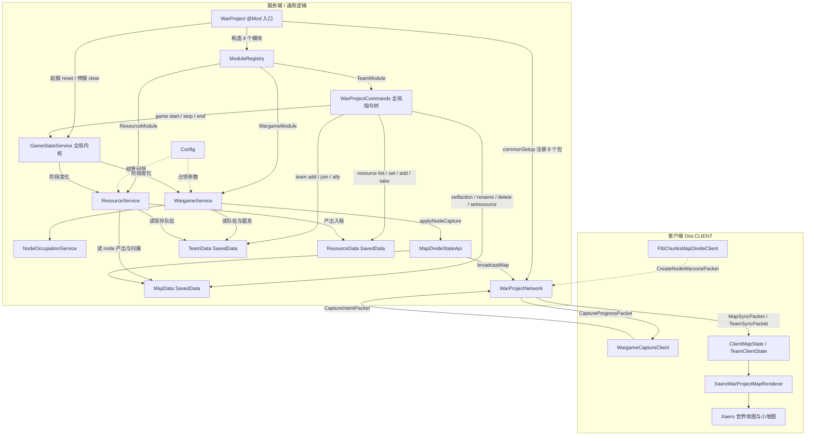

# War Project — 项目结构与运行流程说明

> 分析对象：本仓库（Minecraft Forge 1.20.1 模组 `war_project` v1.0.0）
> 分析方式：通读全部 32 个 Java 源文件 + 3 个资源文件 + Gradle 构建脚本，并用 grep 交叉核验真实依赖边。
> 配套可视化：`docs/architecture.html`（可交互架构图）、`docs/architecture.json`（生成规格）。

---

## 1. 项目一句话

把世界按**区块**切成「节点 Node」与「战区 Warzone」，玩家所属**队伍 Team**在敌方节点区块内驻留够时间就能把节点打下来（改阵营）；地图上的归属配色由客户端渲染层叠到 Xaero / FTB Chunks 地图上。

四个业务子系统：**地图划分（map）**、**队伍（team）**、**兵棋占领（wargame）**、**资源经济（resource，弹药 ammo / 燃料 fuel 两种产出）**；另有一个**全局游戏生命周期内核（module/GameStateService）**，它不属于任何模块，负责 `/warproject game start|stop|end` 的阶段状态并向订阅者广播。模块之间互不直接耦合：资源与占领各自订阅阶段变化，其余全部通过 `WarProjectNetwork` 与三个 `SavedData` 交换数据。

---

## 2. 目录层级

```
War_Project/
├─ build.gradle                # ForgeGradle 6 构建脚本（含可选兼容源码集开关）
├─ settings.gradle             # 插件仓库（MinecraftForge Maven）
├─ gradle.properties           # MC 1.20.1 / Forge 47.4.10 / modid / 版本
├─ gradlew(.bat)  gradle/      # Gradle 8.8 wrapper
├─ src/main/resources/
│  ├─ META-INF/mods.toml       # 模组元数据 + Mixin 配置声明 + 可选依赖
│  ├─ mixins.war_project.json  # Mixin 配置（required=false，3 个 Xaero 客户端 Mixin）
│  └─ pack.mcmeta
├─ src/main/java/com/flowingsun/war_project/
│  ├─ WarProject.java          # ★ 入口：@Mod，构造模块、注册事件与配置
│  ├─ Config.java              # ForgeConfigSpec：占领秒数 / 速率 / 调试开关
│  ├─ module/                  # 模块契约与注册表（WarProjectModule, ModuleRegistry）
│  │                           # + 全局游戏生命周期内核（GamePhase, GameStateService，不属于模块）
│  ├─ map/                     # 节点 / 战区：MapData(SavedData), MapDivideModule, MapDivideStateApi
│  ├─ team/                    # 队伍：TeamData(SavedData), TeamApi, TeamModule, TeamChatService, TeamClientState
│  ├─ wargame/                 # 占领：WargameModule, WargameService, NodeOccupationService, CaptureProgressQueryApi
│  ├─ resource/                # 资源经济：ResourceKind, ResourceData(SavedData), ResourceService, ResourceApi, ResourceModule
│  ├─ client/Resource*.java    # 资源 HUD：ResourceClientState（快照镜像）+ ResourceHudOverlay（顶部 ammo/fuel 条）
│  ├─ client/SuperbWarfareCompat.java  # SBW 可选兼容（纯类名判定，无编译期依赖）
│  ├─ net/                     # WarProjectNetwork：SimpleChannel + 8 个数据包
│  ├─ command/                 # WarProjectCommands：/warproject 全局指令树（含 game / resource）
│  ├─ client/                  # ClientMapState, WargameCaptureClient, client/xaero/XaeroWarProjectMapRenderer
│  └─ mixin/                   # WarProjectMixinPlugin：按类是否存在决定是否应用 Xaero Mixin
├─ src/optionalXaero/java/     # 可选兼容层（9 个文件）：Xaero 世界地图 / 小地图高亮与叠加
├─ src/optionalFtb/java/       # 可选兼容层（1 个文件）：FTB Chunks 大地图编辑器
├─ scripts/                    # 与 mod 无关的本地辅助脚本（DSH 渲染器 vendor / KaTeX / Mermaid 校验）
└─ build/                      # ForgeGradle 中间产物
```

**可选源码集机制**：`build.gradle` 在 `libs/` 与 `D:/mc/.minecraft/versions` 里按文件名片段查找 Xaero / FTB / Architectury 的 jar；找到才把 `src/optionalXaero/java`、`src/optionalFtb/java` 加入 `sourceSets.main`。找不到时这些类根本不参与编译，`WarProjectMixinPlugin` 返回 `false` 使对应 Mixin 不应用，模组本体照常运行。

---

## 3. 主流程图



### 补充：占领闭环时序


---

## 4. 模块逐项说明

### 入口与骨架

| 模块 | 文件 | 职责 |
| --- | --- | --- |
| 模组入口 | `WarProject.java` | `@Mod("war_project")` 入口。构造 `MapDivideModule / TeamModule / WargameModule`，交给 `ModuleRegistry`；注册 `FMLCommonSetupEvent`、`ServerStarting/Stopping`、`RegisterCommands`、`PlayerLoggedIn` 到 Forge 事件总线；注册 Common 配置。内部静态类 `ClientModEvents` 在 `Dist.CLIENT` 下注册 `WargameCaptureClient`。 |
| 模块注册表 | `module/ModuleRegistry` + `WarProjectModule` | 定义统一生命周期接口（`onCommonSetup / onClientSetup / onServerStarting / onServerStopping / onRegisterCommands`），并把事件按顺序转发给三个模块。是「加新子系统」的唯一扩展点。 |
| 配置 | `Config.java` | `ForgeConfigSpec` 定义 7 项：节点占领基础秒数、停止后每秒回退、每多一名领先玩家的加速倍率与其上限、占领调试日志开关、资源结算间隔秒数（`resourceSettleIntervalSeconds`，默认 5）、资源结算调试日志开关。 |
| 全局游戏内核 | `module/GamePhase` + `module/GameStateService` | 三态生命周期 `STOPPED / RUNNING / ENDED`。**不属于任何模块**：由入口在起服时 `reset()`（阶段不落盘，开服固定 STOPPED）、停服时 `clearActive()`；`transition(server, target)` 同步回调订阅者，单个订阅者异常只记日志。 |

### 三大业务子系统

| 模块 | 文件 | 职责 |
| --- | --- | --- |
| 地图划分 | `map/MapData` | `SavedData`（`war_project_map`，挂在主世界 DataStorage）。存 `Node`（id / 名称 / 阵营 / 颜色 / 更新时间 / 区块集合）与 `Warzone`（额外绑定 `nodeId`）。负责增删改、重命名、阵营写入、NBT 读写、区块重叠校验、客户端快照。 |
| | `map/MapDivideModule` | 服务端启动时把 `MapData` 标脏触发落盘；客户端启动时若检测到 FTB Library + FTB Chunks 就**反射**注册 `FtbChunksMapDivideClient`（用反射是为了 jar 缺失时不触发 NoClassDefFoundError）。 |
| | `map/MapDivideStateApi` | 地图状态**门面**：区块→节点/战区查询、快照读取、创建节点+战区、改阵营、重命名；任何写操作成功后统一 `broadcastMap`。重命名还会同步改 `NodeOccupationService` 的进度键。 |
| 队伍 | `team/TeamData` | `SavedData`（`war_project_teams`）。存 `Team`：显示名、颜色、友伤、名牌/死亡消息可见性、碰撞规则、前缀后缀、成员、管理员、盟友。提供加入/退出/清空/设管理员/改属性/结盟/查玩家所属队伍。 |
| | `team/TeamApi` | 队伍门面：查玩家队伍、校验阵营 id 合法性、判断是否同盟、广播队伍快照。 |
| | `team/TeamModule` | 服务端启动注册 `TeamChatService`；`onRegisterCommands` 调 `WarProjectCommands.register`。 |
| | `team/TeamChatService` | `ServerChatEvent`（HIGHEST 优先级）拦截：处于队伍频道的玩家，其聊天被取消并按队伍转发；`/warproject team msg switch` 切换公共/队伍频道。装有 e33chat 且其群组引擎可用时，频道切换交给 e33chat 的群组页签，本服务不再拦截。 |
| | `team/TeamE33ChatBridge` | 可选 e33chat 集成（纯反射，无编译期依赖）：把每个队伍与每个「同盟簇」声明成 e33chat 群组，队伍随即出现在 e33chat 的群组页签里。 |
| 兵棋占领 | `wargame/WargameService` | 核心玩法循环。挂 Forge 事件总线，`ServerTickEvent` 每 20 tick 执行：清理过期意图（TTL 60 tick）→ 按节点统计各队伍在场人数 → `uniqueLeader`（并列则无人领先）→ 与当前阵营同盟则不进反退（`recover`）→ 否则按人数倍率推进度、广播进度、≥50% 且原属某队时先中立化、≥阈值时把节点判给攻方并清进度。 |
| | `wargame/NodeOccupationService` | 占领进度内存表（`nodeId → Progress(attackerFactionId, progressSeconds)`），支持重命名搬迁。不落盘，重启即清空。 |
| | `wargame/CaptureProgressQueryApi` | 只读查询门面，供 `/warproject progress node` 使用。 |
| | `wargame/WargameModule` | 服务端启动把 `WargameService` 注册到事件总线并订阅游戏阶段，停止时反注册、移除监听并 `clearActive()`。 |
| 资源经济 | `resource/ResourceKind` | 两种资源的唯一枚举：`AMMO("ammo")` / `FUEL("fuel")`，`parse(String)` 供指令与包解析；非法值不猜测、直接失败。 |
| | `resource/ResourceData` | `SavedData`（`war_project_resources`）。每队一对存量（`teams[] = {id, ammo, fuel}`；旧档单值键 `amount` 迁移为 ammo），提供 `stock` / `setAmount` / `addAmount` / `addStocks` / `spend` / `clearAll`。**落盘**，重启后存量保留。两种资源有**硬上限 999**（`ResourceData.MAX_AMOUNT`）：结算入账、管理员 set/add、NBT 读档全部经同一个 clamp，超过 999 的旧档会在读档时被压回 999。 |
| | `resource/ResourceService` | 挂 Forge 总线，`ServerTickEvent` 累计 tick：阶段非 RUNNING 时清零待结算 tick（不补算），攒满 `intervalTicks = max(1, round(resourceSettleIntervalSeconds * 20))` 后按真实经过秒数分别结算 `ammoPerMinute * elapsedSeconds / 60` 与 `fuelPerMinute * elapsedSeconds / 60`，只发给 node 归属且在 `TeamData` 中仍存在的队伍（盟友不分成）。 |
| | `resource/ResourceApi` | 服务端门面：`stock` / `stocks`（只列现存队伍）/ `set` / `add`（管理员，任意阶段，写入同样受 999 上限夹紧）/ `spend(kind)`（消耗，仅 RUNNING）。 |
| | `resource/ResourceModule` | 注册服务与阶段监听；收到 `ENDED` 时清空所有队伍资源（两种一起），并在任何阶段变化后广播一次资源快照（HUD 显隐与刷新）。 |
| 资源 HUD | `client/ResourceClientState` + `client/ResourceHudOverlay` | 服务端 `ResourceSyncPacket` 的客户端镜像；HUD 注册在 `VanillaGuiOverlay.HOTBAR` 之上，只在 `running=true` 且本地玩家属于某队时显示（本地玩家处于 Superb Warfare 载具第一人称／炮镜视角时整条隐藏，见 `client/SuperbWarfareCompat`）：屏幕正上方居中，两条「图标 + 当前量 + `+每60s增量`」（图标 `assets/war_project/textures/gui/ammo.png` / `fuel.png`，128×128 缩放到 16×16；速率为该队全部归属 node 的 60s 产出之和，0 时用灰色）。 |
| | `map/MapData#setNodeResourceOutputs` | mapdevide 侧只存「该 node 60 秒的弹药与燃料产出量」两个数值（NBT `ammo_per_minute` / `fuel_per_minute`；旧的单值键 `resource_per_minute` 迁移为 ammo），结算不在这里发生；`resetAllNodeFactions()` 供 `ENDED` 把全部 node 及其 warzone 重置为 neutral。 |

#### e33chat 可选集成（队伍 / 同盟 → 群组）

`team/TeamE33ChatBridge` 反射调用 e33chat 的 `com.niuqu.chatbubble.api.E33ChatGroupApi#replaceOwnerGroups`，把 `TeamData` 声明成群组：每个队伍一个群组，每个「同盟簇」（盟友关系的连通分量）一个以 `盟·` 为前缀的群组。声明是**替换式**的——每次同步提交完整集合，e33chat 会删除本方未再声明的群组；成员按玩家名声明，离线成员由 e33chat 自己的登录钩子补齐，本模组不做补员。同步触发点三处，全部在 `team` 包内：`TeamApi.broadcast`（全部队伍变更命令的共同出口）、`TeamModule.onServerStarting`（开机首次声明）、`TeamModule.onPlayerLoggedIn`（自愈被 e33chat 浏览器退出或 OP 删除掉的群组）。

装有 e33chat 且其群组引擎可用时，`/warproject team msg switch` 只做提示，队伍频道交由 e33chat 的群组页签；e33chat 缺失、无群组 API 或服务端关闭群组（`groups_enabled=false`）时，回退到本模组自己的队伍频道广播。反射失败不影响队伍命令与聊天，只会让桥接退化为 no-op。

### 网络层

| 模块 | 职责 |
| --- | --- |
| `net/WarProjectNetwork` | 单例 `SimpleChannel`（`war_project:main`，协议号 `4`）。注册 9 类包：**S→C** `MapSyncPacket`、`TeamSyncPacket`、`CaptureProgressPacket`、`CaptureNoticePacket`、`ResourceSyncPacket`；**C→S** `CaptureIntentPacket`、`CreateNodeWarzonePacket`、`EditMapObjectPacket`、`SetNodeResourcePacket`。写地图的 C→S 包（含 `SetNodeResourcePacket`）都在服务端做 **OP 2 级权限校验**。所有 payload 都是 NBT `CompoundTag` 或长整型集合，客户端侧用 `DistExecutor.unsafeRunWhenOn(Dist.CLIENT, ...)` 隔离。资源通过 `ResourceSyncPacket` 广播：每队存量 + 该队每 60s 速率（每 5s 结算后、阶段变化后、玩家登录时各推一次）。 |

### 指令与客户端

| 模块 | 文件 | 职责 |
| --- | --- | --- |
| 指令树 | `command/WarProjectCommands` | `/warproject`（需 OP 2 级），**全局命令树，唯一注册点**（`TeamModule.onRegisterCommands` 调 `WarProjectCommands.register`）。子命令：`chunk info`、`map set`、`node list/info/setfaction/rename/delete`、`node setresource <nodeId> <ammoPerMinute> <fuelPerMinute>`、`warzone list/info/node`、`progress node`、`game start|stop|end|status`、`resource list/team`、`resource set|add|take <team> <ammo|fuel> <amount>`（正数写入被夹到上限 999，回显为实际存量）、`team add/remove/empty/join/leave/list/msg switch/admin set|remove/modify/ally`。补全来自 `MapDivideStateApi` 与 `TeamData`。node 与战区只能成对存在，因此删除入口只有 `node delete`，它连带删掉该 node 绑定的战区；没有独立的战区删除指令；战区阵营也一律由 `node setfaction` 下发（`warzone setfaction` 已取消），两者立场不会互相矛盾。 |
| 指令归属 | `/warproject game ...` | **全局指令，不属于任何模块**：它只调用 `module/GameStateService`；`resource` 与 `wargame` 各自订阅阶段变化并在自己的包里反应（资源清空、node 重置）。 |
| 客户端占领探测 | `client/WargameCaptureClient` | 每 20 tick 检查本地玩家所在区块是否属于「非本方且非同盟」的节点；是则发 `CaptureIntentPacket`。同时接收进度回包存到 `lastNodeId/lastProgress`（预留 HUD 接口，目前无消费方）。 |
| 客户端状态镜像 | `client/ClientMapState`、`client/ResourceClientState`、`team/TeamClientState` | 保存服务端下发的 NBT / 资源快照并提供 `version` 版本号，作为渲染层的失效判据与查询源。 |
| 渲染计算 | `client/xaero/XaeroWarProjectMapRenderer` | 与具体地图模组无关的纯计算层：按「本方/同盟=蓝、敌对=红、中立=白」解析阵营配色；战区做半透明填充 + 虚线边、节点做实线边，只在区域外边界描边；`regionHash` 把地图版本、队伍版本、区块归属、阵营关系混合成一个哈希，供地图模组做重绘缓存键。 |
| 可选兼容 | `src/optionalXaero`（9 文件） | `XaeroWorldMapSessionMixin` / `XaeroMinimapSessionMixin` 用 `@Redirect` 挂进 Xaero 的 `HighlighterRegistry.end()` 完成注册；`XaeroCommonMinimapRendererMixin` 在小地图渲染前绘制叠加层；`XaeroWorldMapScreenOverlay` 通过 `ScreenEvent.Render.Post` 反射读相机/缩放字段直接绘制战区与节点边框。 |
| 可选兼容 | `client/SuperbWarfareCompat` | 主源码集内的**零依赖**兼容（不新增编译期依赖、不改 build.gradle）：HUD 渲染前判断「本地玩家的载具类名（沿父类链）以 `com.atsuishio.superbwarfare.entity.vehicle` 开头」且「`Minecraft.options.getCameraType().isFirstPerson()` 为真」，满足则整条资源灵动岛不渲染。第一人称用 vanilla 判定，因为 SBW 自己的 `RenderContext#isFirstPerson()` 反编译后就是同一个表达式（`Options.m_92176_().m_90612_()Z`）。SBW 缺失时该类永远返回 false，本模组行为不变。 |
| 可选兼容 | `src/optionalFtb`（1 文件） | `FtbChunksMapDivideClient`：在 FTB Chunks 大地图上提供工具栏与拖拽选区，两阶段「选节点区块 → 命名 → 选战区区块 → 确认」，发 `CreateNodeWarzonePacket`；前置校验（战区须包含全部节点区块、至少一个非节点区块）在客户端先提示，服务端再兜底校验。 |

---

## 5. 主运行流程（文字版）

1. **加载**：Forge 构造 `WarProject` → 四个模块（mapdivide / team / resource / wargame）入 `ModuleRegistry` → `FMLCommonSetupEvent` 里 `WarProjectNetwork.register()`（注册 8 个包）并广播 `onCommonSetup`。
2. **起服**：`ServerStartingEvent` → 各模块把 `SavedData` 标脏（触发读取/落盘）并挂接服务与聊天监听（`resource` / `wargame` 同时订阅 `GameStateService`），入口随后把全局阶段重置为 STOPPED；`RegisterCommandsEvent` → 注册 `/warproject`。
3. **进服**：`PlayerLoggedInEvent` → 给该玩家单独推送 `MapSyncPacket` 与 `TeamSyncPacket`。
4. **占领闭环**（客户端每 20 tick 探测 + 服务端每 20 tick 结算）：意图包 → 服务端复核 → 人数领先方推进度 → 进度回包驱动客户端显示 → 50% 中立化 → 满值改阵营 → `broadcastMap` → 所有客户端 `ClientMapState.replace` → 渲染层按帧重绘叠加。
5. **建设闭环**（OP）：FTB 大地图拖拽选区 → 提交 → 服务端权限与重叠校验 → `MapData.saveNodeWithWarzone` → 广播。
6. **游戏生命周期**（OP，全局）：`/warproject game start|stop|end` → `GameStateService.transition` 改阶段并同步通知订阅者：`resource` 在 ENDED 清空全部队伍资源，`wargame` 在 ENDED 把全部 node 重置为 neutral 并清空占领进度与意图；STOPPED 只冻结（占领进度、资源存量、node 归属都保留）。阶段不落盘，开服一律 STOPPED。
7. **资源结算闭环**：`resource` 每 `resourceSettleIntervalSeconds`（默认 5s）结算一次，遍历 node：归属为真实队伍且弹药/燃料产出有值时，按「产出 * 经过秒数 / 60」分别计入该队伍的 ammo 与 fuel（每项夹在上限 999 之内）；`/warproject resource ...` 与 FTB 右键菜单（Set ammo output / Set fuel output）可查看与调整；每次结算后广播 `ResourceSyncPacket`，客户端顶部 HUD 据此刷新存量与 `+每60s速率`。
8. **管理闭环**（OP）：`/warproject` 读写 `MapData` / `TeamData` / `ResourceData`，写成功即广播对应快照。

---

## 6. 技术栈 · 运行方式 · 关键入口

**技术栈**

- Java 17（`java.toolchain.languageVersion = 17`）
- Minecraft 1.20.1 + Forge 47.4.10（`modLoader = javafml`，loader 区间 `[47,)`）
- ForgeGradle `[6.0,6.2)` + Gradle 8.8，Mojang `official` 映射（`mapping_version = 1.20.1`）
- SpongePowered Mixin（`mixins.war_project.json`，`required=false`、`defaultRequire=0`）
- 存档：Forge `SavedData`（NBT），挂在主世界 DataStorage（`war_project_map` / `war_project_teams` / `war_project_resources`（每队 ammo + fuel）；游戏阶段刻意不落盘）
- 网络：Forge `SimpleChannel`
- 可选编译期依赖：Architectury / FTB Library / FTB Chunks / Xaero World Map / Xaero Minimap（`compileOnly`，仅用于兼容层）

**运行方式**

```bash
./gradlew runClient        # 启动带模组的客户端（工作目录 run/）
./gradlew runServer        # 启动专用服务端（--nogui）
./gradlew runGameTestServer
./gradlew runData          # 数据生成（src/generated/resources）
./gradlew build            # 产出 build/libs/war_project-1.0.0.jar
```

`gradle.properties` 里 `org.gradle.daemon=false`、`-Xmx3G`；`gradlew --refresh-dependencies` 可刷新依赖缓存。

**关键入口**

| 类型 | 位置 |
| --- | --- |
| 代码入口 | `src/main/java/com/flowingsun/war_project/WarProject.java`（`@Mod`） |
| 模块分发 | `module/ModuleRegistry.java` |
| 网络注册 | `WarProjectNetwork.register()`（在 `commonSetup` 中调用） |
| 指令注册 | `command/WarProjectCommands.register()`（由 `TeamModule.onRegisterCommands` 调用） |
| 配置文件 | `gradle.properties`、`build.gradle`、`src/main/resources/META-INF/mods.toml`、`src/main/resources/mixins.war_project.json`、`Config.java`（运行期生成 `config/war_project-common.toml`） |

---

## 7. 备注：目前未被消费的接口

交叉 grep 的结果，以下几处是预留但尚无调用方，阅读代码时可先跳过：

- `WarProjectModule.id()`：仅定义，`ModuleRegistry` 未使用（可用于日志/诊断）。
- `WargameCaptureClient.lastNodeId() / lastProgress()`：进度回包已写入，但没有任何 HUD 读取。
- `XaeroWarProjectMapRenderer.renderChunk()`：`WarProjectWorldMapHighlighter.getChunkHighlitColor()` 返回 `null`，实际绘制走 `XaeroWorldMapScreenOverlay` / `XaeroMinimapScreenOverlay`，`renderChunk` 暂为遗留路径。
